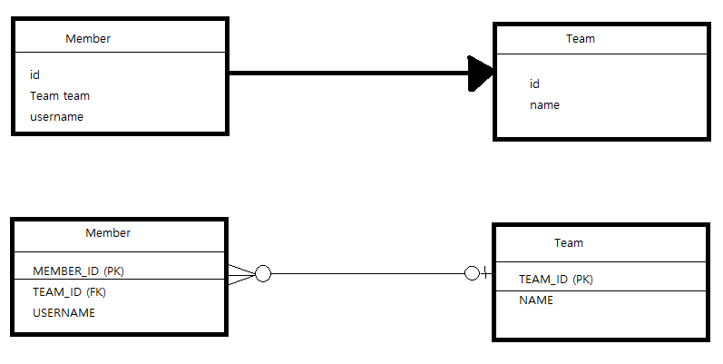
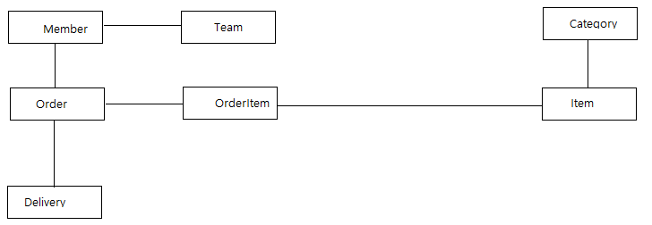
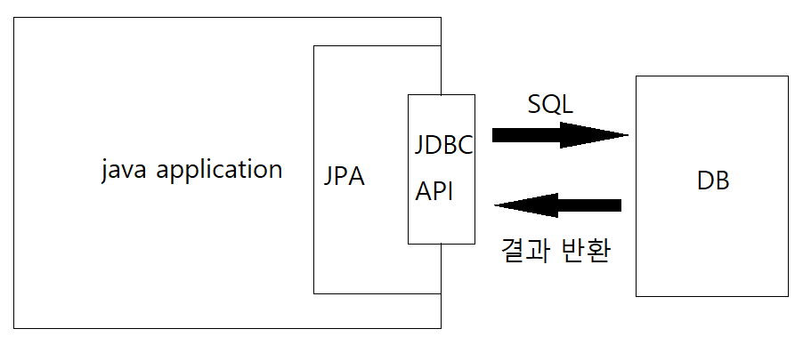
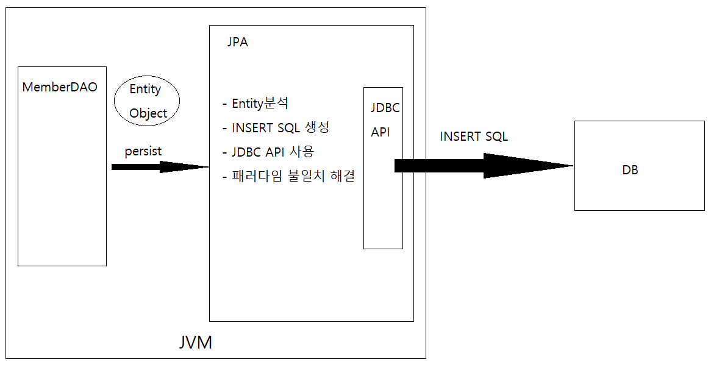
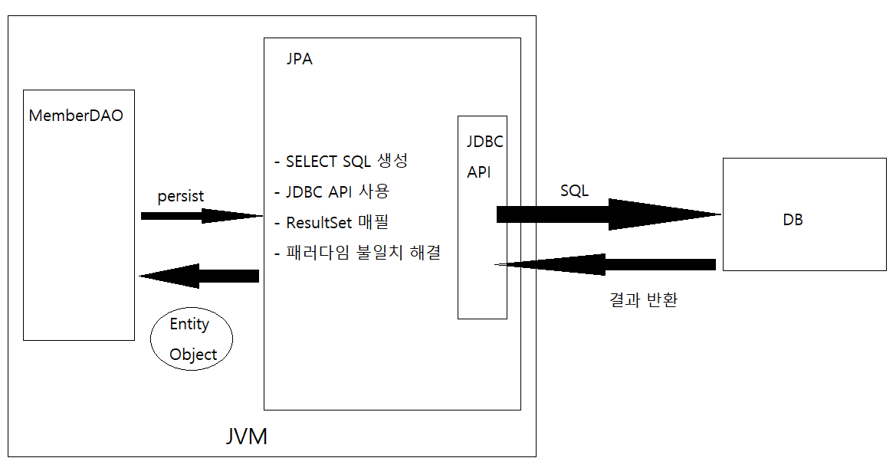

- 참조를 사용하는 객체와 외래 키를 사용하는 관계형 데이터베이스 사이의 패러다임 불일치

```java
class Member {
    Team team;

    Team getTeam() {
        return team;
    }
}

class Team {

}

member.getTeam(); // member -> team 접근

```

- Member 객체는 Member.team 필드에 Team 객체의 참조를 보관, 관계를 맺는다.
- 이 참조 필드를 통해 Member와 관련된 Team을 조회할 수 있다.
- 다만 객체는 참조가 있는 방향으로만 조회가 가능하다.
- Member에서 Team을 조회하는건 가능하지만 Team에서 Member는 조회가 불가능하다.

```sql
SELECT M.*, T.*
FROM MEMBER m
         JOIN TEAM T ON M.TEAM_ID = T.TEAM_ID
```

- MEMBER 테이블은 MEMBER.TEAM_ID 외래키 컬럼을 통해 TEAM 테이블과 관계를 맺는다.
- 이 외래키를 통해 두 테이블을 조인하면 MEMBER 테이블과 연관된 TEAM 테이블을 조회할 수 있다.
- 외래키를 사용하면 참조와는 다르게 MEMBER JOIN TEAM과 TEAM JOIN MEMBER를 사용하여 서로 조회가 가능하다.

```java
//테이블에 맞춘 객체 모델
class Member {
    String id;
    Long teamId;
    String userName;
}

class Team {
    Long id;
    String name;
}

    Team t = member.getTeam(); // 사용불가
```

- 위와 같이 MEMBER 테이블과 TEAM 테이블에 맞춰서 클래스를 만들면 각 테이블에 저장하고 조회할때는 편리하다.
- 하지만 더이상은 참조를 통해 연관된 객체를 찾을 수가 없게 된다.

- 특정 회원이 소속된 팀을 조회하는 가장 객체지향적인 방법은 참조를 사용하는것!

```java
class Member {
    String id;
    Team team;
    String userName;

    Team getTeam() {
        return team;
    }
}

class Team {
    Long id;
    String name;
}

    Team team = member.getTeam();
```

- Member.team 필드는 연관된 Team의 참조를 보관하고 이제 회원과 연관된 팀을 조회할 수 있다.
- 하지만 이러면 객체를 테이블에 저장하거나 조회하기가 쉽지 않다.
- 그 이유인즉슨 객체 모델은 외래 키가 필요 없고 테이블은 탐조가 필요없기 때문이다. (패러다임 불일치)
- 결국 개발자가 중간에서 변환을 해줘야 한다.

저장

- 객체를 데이터베이스에 저장하기 위해 team 필드를 TEAM_ID 외래 키 값으로 변환해줘야 한다.

```java
        member.getId();
        member.getTeam().getId(); //TEAM_ID 외래 키 값으로 변환
        member.getUsername();
```

조회

- 조회할 때는 반대로 TEAM_ID 외래키 값을 Member 객체의 team 참조로 변환해서 객체에 보관해야 한다.

```sql
SELECT M.*, T.*
FROM MEMBER M
         JOIN TEAMT ON M.TEAM_ID = T.TEAM_ID
```

```java
public Member find(String memberId){
        //SQL 실행
        Member member=new Member();
        //데이터베이스에서 조회한 회원 관련 정보를 모두 입력
        Tesm team=new Team();
        //데이터베이스에서 조회한 팀 관련 정보를 모두 입력

        member.setTeam(team);
        return member;
}
```


JPA와 연관관계
- JPA는 연관관계와 관련된 패러다임의 불일치 문제를 해결해준다.
```java
member.setTeam(team); //회원 팀 간의 연관관계 설정
jpa.persist(member); // 회원과 연관관계를 함께 저장
```
- 회원 저장시 위의 코드에서 jpa는 team의 참조를 외래키로 변환해서 적절한 INSERT 쿼리를 데이터베이스에 전달한다.
- 객체 조회시에도 외래키를 참조로 변환하는 일도 처리해준다.
```java
Member member = jpa.find(Member.class, memberId);
Team team = member.getTeam();
```
- 하지만 지금까지 설명한 문제들은 SQL을 직접 다루어도 어느정도 극복할 수 있는 문제들이었다.


객체 그래프 탐색

```sql
SELECT M.*, T.*
    FROM MEMBER M
    JOIN TEAM T ON T.TEAM_ID = M.TEAM_ID
```

- 객체는 객체 그래프를 마음껏 탐색할 수 있어야 하지만 만약 SQL 실행시 위와 같이 Team에 대한 데이터만 조회했다면 member.getTeam()은 조회를 할 수 있지만 member.getOrder()와 같은 객체 그래프는 데이터가 없으므로 탐색할 수 없다.
- 처음 실행하는 SQL에 따라 객체그래프를 어디까지 탐색할 수 있는지 정해진다.
```java
class MemberService {
    public void process() {
        Member m = memberDAO.find(memberId);
        member.getTeam();
        member.getOrder().getDelivery();
    }
}
```
- 위의 예제만을 봐선 사실 getDelivery()까지 객체 그래프 탐색이 가능한지 알 방법이 없다.
- 어디까지 탐색이 가능한지 확인하기 위해서는 데이터 접근 계층인 DAO를 열어서 직접 SQL을 확인해야만 한다.
- 하지만 이를 해결하고자 연관된 모든 객체 그래프를 조회해서 애플리케이션 메모리에 올려두는건 현실성이 없다.
- 상황에 맞는 조회 메서드를 DAO에 매번 만들어 두는것도 현실성이 없다
```java
//모든 상황에 맞는 조회 메서드를 구현한다...?
memberDAO.getMember();
memberDAO.getMemberWithTeam();
memberDAO.getMemberWithOrderWithDeliviery();
```

JPA와 객체 그래프 탐색
- JPA는 연관된 객체를 사용하는 시점에 적절한 SELECT SQL를 실행한다.
- 언제든 연관된 객체를 신뢰하고 마음껏 조회할 수 있다.
- 실제 객체를 사용하는 시점까지 필요한 데이터 조회를 미루기 때문에 **지연로딩** 이라고 한다.
```java
Member member = jpa.find(Member.class, memberId);

Order order = member.getOrder();
order.getOrderDate(); //실제 Order 객체를 사용하는 시점에 SELECT ORDER SQL
```
- 만약 Member를 사용할때마다 반드시 Order가 같이 사용된다면 위와 같이 한 테이블씩 조회하기 보다는 Member 조회시 SQL JOIN을 사용해 Member와 Order를 함께 조회하는것이 효과적이다.
- 연관된 객체를 즉시 함께 조회할지, 실제 사용되는 시점에 지연조회를 할지 설정하면 JPA는 그에 맞춰서 SQL을 실행해 연관된 데이터도 함께 조회한다.
```sql
SELECT M.*, O.*
    FROM MEMBER M
    JOIN ORDER O ON M.MEMBER_ID = O.MEMBER_ID
```

비교
- JPA는 같은 Transaction일 때 같은 객체가 조회되는것을 보장한다.
```java
String memberId = "100";
Member member1 = jpa.find(Member.class, memberId);
Member member2 = jpa.find(Member.class, memberId);

member1 == member2 // true
```


JPA란 무엇인가
- 자바 진영의 ORM 기술 표준으로 자바 Application와 JDBC 사이에서 동작한다

  
ORM
- Object-Relation Mapping은 객체와 관계형 데이터 베이스를 매핑한다는 뜻
- ORM 프레임워크는 객체와 테이블을 매핑해 페러다임의 불일치를 개발자 대신 해결한다.
- 단순히 SQL을 대신 생성해주는 것이 아니다


- 개발자는 그저 객체와 데이터베이스를 어떻게 매핑해야 하는지 매팡 방법만 ORM 프레임워크에 알려주면 된다.