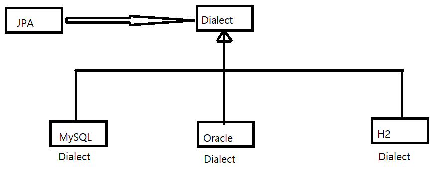
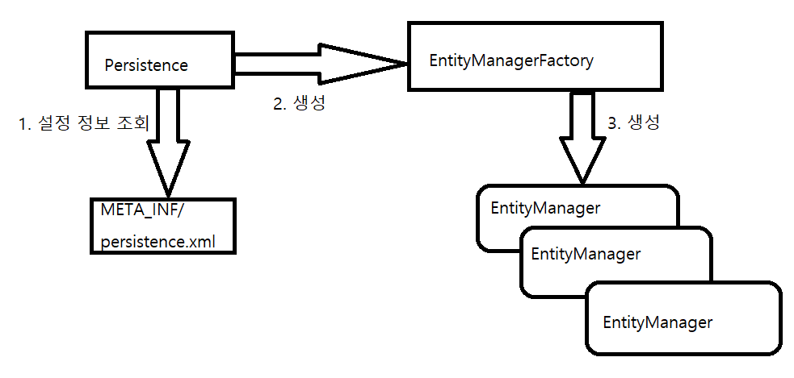

- @Entity
- 해당 어노테이션이 붙은 클래스를 테이블과 매핑한다고 JPA에게 알린다. 엔티티 클래스라고 부른다.

- @Table
- 엔티티 클래스에 매핑할 테이블 정보를 알려준다.
- @Table(name = "MEMBERS") name 속성을 사용해 엔티티를 MEMBER 테이블에 매핑한다.
- 만약 name 속성을 생략하면 단순히 클래스 이름을(더 정확히는 엔티티 이름) 테이블 이름으로 사용한다.

- @Id
- 엔티티 클래스의 필드를 테이블의 기본 키(Primary Key)에 매핑하며 식별자 필드라 한다.

- @Column
- 필드를 컬럼에 매핑한다.

- 매핑 정보가 없는 필드
- 매핑 어노테이션을 생략하면 필드 이름을 사용해 컬럼과 매핑을 한다.
- 만약 DB가 대소문자를 구분한다면 @Column(name="AGE")와 같이 명시적으로 매핑해야 한다.

- 매핑작업을 통해 JPA는 어떤 엔티티를 어떤 테이블에 저장해야 하는지 알 수 있게 되었다.

### JPA 기본 설정 파일 Persistence.xml

- JPA는 persistence.xml을 사용해 필요한 설정 정보를 관리한다.
- 설정 파일이 META-INF/persistence.xml 클래스 패스 경로에 있으면 별도의 설정 없이 JPA가 인식한다.

```xml
<?xml version="1.0" encoding="UTF-8"?>
<!-- xml 네임스페이스와 사용할 버전을 지정 -->
<persistence xmlns="http://xmlns.jcp.org/xml/ns/persistence" version="2.1">
    <!-- 영속성 유닛에 고유한 이름을 부여 -->
    <persistence-unit name="jpabook">

        <properties>

            <!-- 필수 속성 -->
            <property name="javax.persistence.jdbc.driver" value="org.h2.Driver"/>
            <property name="javax.persistence.jdbc.user" value="sa"/>
            <property name="javax.persistence.jdbc.password" value=""/>
            <property name="javax.persistence.jdbc.url" value="jdbc:h2:tcp://localhost/~/test"/>
            <property name="hibernate.dialect" value="org.hibernate.dialect.H2Dialect"/>

            <!-- 옵션 -->
            <property name="hibernate.show_sql" value="true"/>
            <property name="hibernate.format_sql" value="true"/>
            <property name="hibernate.use_sql_comments" value="true"/>
            <property name="hibernate.id.new_generator_mappings" value="true"/>

            <!--<property name="hibernate.hbm2ddl.auto" value="create" />-->
        </properties>
    </persistence-unit>

</persistence>
```

- hibernate 속성
- hibernate.dialect: 데이터베이스 방언 설정

#### 데이터 베이스 방언

- JPA는 특정 데이터베이스에 종속적이지 않은 기술이기 때문에 프로젝트의 데이터베이스를 손쉽게 교체할 수 있다.
- 다만 데이터베이스마다 조금씩 SQL 문법이 다르다는 문제점이 발생한다.
- SQL 표준을 지키지 않거나 특정 데이터베이스만의 고유한 문법 혹은 기능을 방언(Dialect)이라 한다
  
- 개발자는 JPA 표준 문법에 맞춰 JPA를 사용해 개발을 하고 데이터베이스에 의존적인 SQL은 해당 DB의 Dialect가 처리해준다.



1. 설정 정보 조회
2. EntityManagerFactory 생성

- 우선 persistence.xml의 설정 정보를 사용해서 엔티티 매니저 팩토리를 생성해야 한다.

```java
//엔티티 매니저 팩토리 생성
//Persistence 클래스를 사용하여 엔티티 매니터 팩토리 생성
//아래의 코드는 META-INF/persistence.xml에서 이름이 "jpabook"인 영속성 유닛을 찾아 엔티티 메니저 팩토리를 생성한다.
EntityManagerFactory emf=Persistence.createEntityManagerFactory("jpabook");
```

- 엔티티 매니저 팩토리를 생성하는 비용은 굉장히 높기 때문에 애플리케이션 전체에서 한 번만 생성하고 공유해서 사용하는 것이 좋다.

3. 엔티티 매니저 생성

```java
EntityManager em=emf.createEntityManager(); //엔티티 매니저 생성
```

- JPA 의 기능 대부분은 엔티티 매니저가 제공한다. (데이터베이스 등록/수정/삭제/조회)
- 엔티티 매니저는 내부에 데이터 소스를 유지하면서 데이터베이스와 통신한다. -> 엔티티 매니저를 가상의 데이터베이스로 생각 할 수도 있다.
- **엔티티 매니저는 데이터베이스 커넥션과 밀접한 관계를 가지므로 스레드간에 공유하거나 재사용하면 위험하다.**

```java
em.close(); //엔티티 매니저 종료
        emf.close(); //엔티티 매니저 팩토리 종료
```

- 사용이 완료된 엔티티 매니저는 항상 종료를 해줘야 하며 애플리케이션이 종료될 때 엔티티 매니저 팩토리 역시 종료시켜야 한다.

#### 트랜잭션 관리

- JPA를 사용하면 항상 트랜잭션 안에서 데이터를 변경해야 한다.
- 트랜잭션 외부에서 데이터를 변경하면 예외가 발생한다


- 트랜잭션을 사용하기 위해 엔티티 매니저에서 트랜잭션 API를 받아와야 한다.
- 받아온 트랜잭션 기능을 사용해 비즈니스 로직이 정상 동작하면 트랜잭션을 커밋하고, 예외가 발생하면 롤백한다.
```java
        EntityTransaction tx=em.getTransaction(); //트랜잭션 기능 획득

        try{
            tx.begin(); //트랜잭션 시작
            logic(em);  //비즈니스 로직
            tx.commit();//트랜잭션 커밋

        }catch(Exception e){
            tx.rollback(); //트랜잭션 롤백
        }
```

#### 비즈니스 로직
```java
public static void logic(EntityManager em) {

        String id = "id1";
        Member member = new Member();
        member.setId(id);
        member.setUsername("지한");
        member.setAge(2);

        //등록
        em.persist(member);

        //수정
        member.setAge(20);

        //한 건 조회
        Member findMember = em.find(Member.class, id);
        System.out.println("findMember=" + findMember.getUsername() + ", age=" + findMember.getAge());

        //목록 조회
        List<Member> members = em.createQuery("select m from Member m", Member.class).getResultList();
        System.out.println("members.size=" + members.size());

        //삭제
        em.remove(member);

    }
```
- 등록, 수정, 삭제, 조회 작업이 엔티티 매니저를 통해 수행된다.

##### 등록
- 엔티티를 저장하기 위해서는 엔티티 매니저의 persist() 메소드에 저장할 엔티티를 넘겨주면 된다.
- JPA는 회원 엔티티의 매핑 정보를 분석해서 상황에 맞는 INSERT SQL을 만들어 데이터베이스에 전달한다.
##### 수정
- JPA는 어떤 엔티티가 변경 되었는지 추적하는 기능을 갖추고 있다.
- 엔티티의 값만 변경하면 상황에 맞는 UPDATE SQL을 생성해 데이터베이스에 전달한다.
##### 삭제
- 등록과 비슷하게 엔티티 매니저의 remove를 사용하여 삭제하려는 엔티티를 넘겨주면 상황에 맞는 DELETE SQL을 생성해 전달한다.
##### 한건 조회
- find() 메소드는 조회할 엔티티 타입과 @Id로 데이터베이스 테이블의 기본 키와 매핑한 식별자 값으로 엔티티 하나를 조회하는 가장 단순한 조회 메소드
- find()를 사용하면 상황에 맞는 SELECT SQL을 생성해 데이터베이스에 전달하고 결과를 조회해 결과 값으로 엔티티를 생성해 반환한다.

#### JPQL
```java
//목록 조회
TypedQuery<Member> query = em.createQuery("select m from Member m", Member.class);
List<Member> resultList = query.getResultList();
        
//혹은 간단하게
List<Member> members = em.createQuery("select m from Member m", Member.class).getResultList();
System.out.println("members.size=" + members.size());
```
- JPA를 사용한다는 것은 엔티티 객체를 중심으로 개발을 하고 나머지 DB에 대한 처리는 JPA에 맡기는 것이다.
- 검색쿼리를 만들게 된다면 테이블을 대상으로 검색을 하는것이 아니라 엔티티를 객체를 대상으로 검색해야 한다.
- 하지만 이를 위해서는 DB의 모든 데이터를 엔티티 객체로 불러온 다음에 검색을 해야하는데 사실상 불가능
- 이를 해결하기 위해 JPA는 JPQL(Java Persistence Query Language)이라는 쿼리 언어로 문제를 해결한다.


- JPQL은 SQL을 추상화한 객체지향 쿼리 언어.
- JPQL은 엔티티 객체를 대상으로 쿼리한다. 즉 클래스와 필드를 대상으로 쿼리한다.


- 위의 JPQL에서 "select m from Member m"에 나온 Member는 회원 엔티티 객체를 말하는 것이다. 절대로 MEMBER 테이블이 아니다.