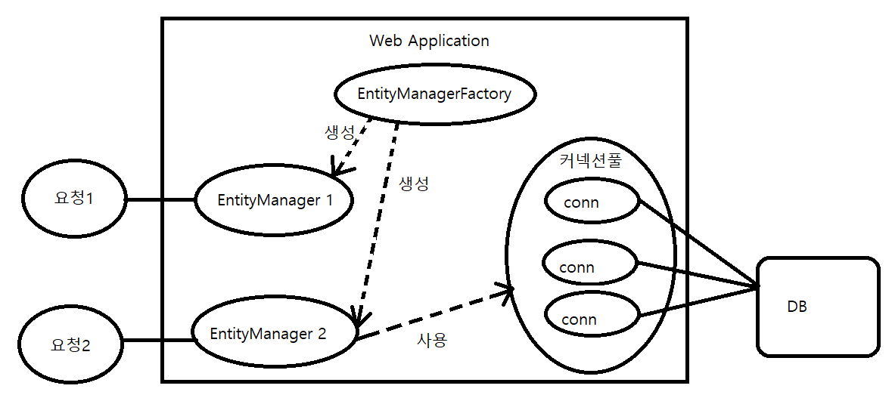
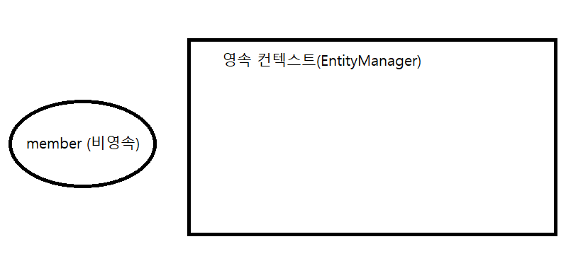
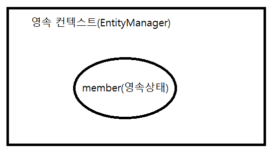
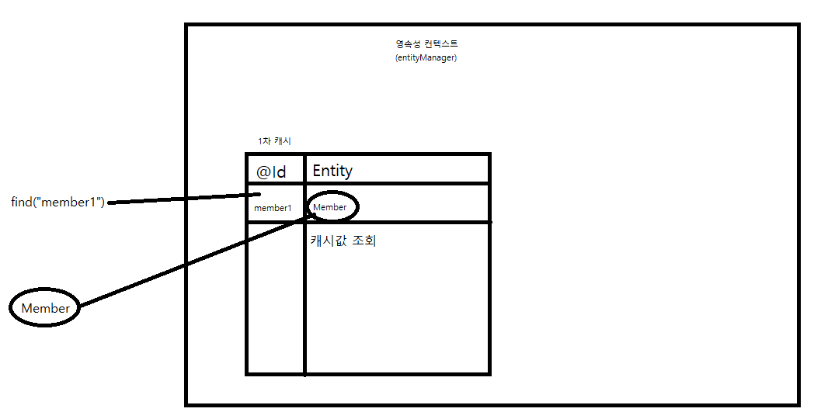
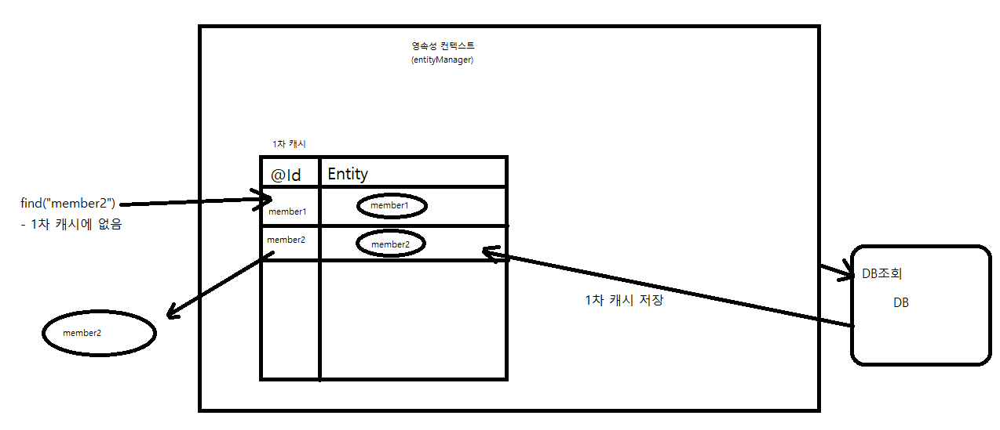

### 영속성 관리
- JPA가 제공하는 기능은 크게 엔티티와 테이블을 매핑하는 설계 부분과 매핑한 엔티티를 실제 사용하는 부분으로 나뉜다.
- 엔티티 매니저는 엔티티를 저장, 수정, 삭제 조회등 엔티티와 관련된 일을 처리한다.
- 엔티티를 저장하는 가상의 데이터 베이스로 생각할 수 있다.

#### 엔티티 매니저 팩토리와 엔티티 매니저
- DB를 하나만 사용하는 애플리케이션은 일반적으로 EntityManagerFactory를 하나만 생성한다.
```java
//비용이 굉장히 높은 EntityManagerFactory 생성
EntityManagerFactory emf = Persistence.createEntityManagerFactory("jpabook");
```
- Persistence의 createEntityManagerFactory("jpabook");을 호출하면 META-INF/persistence.xml에 있는 정보를 바탕으로 EntityManagerFactory를 생성한다.
```xml
<persistence-unit name="jpabook">

        <properties>

            <!-- 필수 속성 -->
            <property name="javax.persistence.jdbc.driver" value="org.h2.Driver"/>
            <property name="javax.persistence.jdbc.user" value="sa"/>
            <property name="javax.persistence.jdbc.password" value=""/>
            <property name="javax.persistence.jdbc.url" value="jdbc:h2:tcp://localhost/~/test"/>
            <property name="hibernate.dialect" value="org.hibernate.dialect.H2Dialect"/>

            <!-- 옵션 -->
            <property name="hibernate.show_sql" value="true"/>
            <property name="hibernate.format_sql" value="true"/>
            <property name="hibernate.use_sql_comments" value="true"/>
            <property name="hibernate.id.new_generator_mappings" value="true"/>

            <!--<property name="hibernate.hbm2ddl.auto" value="create" />-->
        </properties>
    </persistence-unit>
```
- EntityManagerFactory를 성공적으로 생성했다면 이제 필요할 때마다 EntityManager를 생성하면 된다.
```java
//EntityManager의 생성. 비용의 거의 안든다.
EntityManager em = emf.createEntityManager();
```


- EntityManagerFactory는 생성할 때 비용이 굉장히 많이 들기 때문에 전체 애플리케이션에서 하나만 생성하여 공유하도록 설계되어 있다.
- 반면 EntityManager는 생셩 비용이 거의 들지 않는다.


- EntityManagerFactory는 여러 스레드가 동시에 접근해도 안전하지만 EntityManager는 여러 스레드가 동시에 접근하면 **동시성 문제**가 발생하기 때문에 **절대로 스레드간 공유를 하면 안된다**

- EntityManager 1은 아직 DB 커넥션을 얻지 않았다.
    - EntityManager는 DB 연결이 꼭 필요한 시점까지 커넥션을 얻지 않는다.
    - 보통 트랜잭션을 시작할 때 커넥션을 획득한다.
    
- JPA구현체들은 EntityManagerFactory를 생성할 때 커넥션풀을 만드는데 이는 J2SE 환경에서 사용되는 방법이다.
- J2EE환경에서는 해당 컨테이너(스프링이라면 스프링 컨테이너)가 제공하는 데이터 소스를 사용한다. 
            

#### 영속성 컨텍스트란?
- 엔티티를 영구 저장하는 환경
- EntityManager로 엔티티를 저장 혹은 조회를 할 경우 EntityManager는 영속성 컨텍스트에 엔티티를 보관하고 관리한다.
```java
em.persist(member);
```
- persist() 메소드는 EntityManager를 사용해 회원 엔티티를 영속성 컨텍스트에 저장한다.


- 영속성 컨텍스느는 EntityManager를 생성할 때 하나 만들어지며 EntityManager를 통해 접근, 관리할 수 있다.

#### 엔티티 생명주기
1. 비영속: 영속성 컨텍스트와 전혀 관계가 없는 상태
2. 영속: 영속성 컨텍스트에 저장된 상태
3. 준영속: 영속성 컨텍스트에 저장되었다가 분리가 된 상태
4. 삭제: 삭제된 상태

   

###### 비영속
- 엔티티 객체가 갓 생성된 상태에서는 순수한 객체 상태이며 아직 저장은 하지 않은 상태.
- 즉 영속성 컨텍스트나 DB와는 전혀 관련이 없는 상태를 말한다.
```java
Member member = new Member();
member.setId("member1");
member.setUsername("a");
```


###### 영속
- EntityManager를 통해 엔티티를 영속성 컨텍스트에 저장했다.
- 영속성 컨텍스트가 관리하는 엔티티는 영속 상태가 되었고 영속성 컨텍스트에 의해 관리된다.
- em.find() 혹은 JPQL을 사용해 조회한 엔티티 역시 영속성 컨텍스트가 관리하는 영속 상태다.
```java
em.persist(member);
```


###### 준영속
- 영속상태의 엔티티를 영속성 컨텍스트가 관리하지 않으면 준영속 상태가 된다.
- em.detach()를 호출해 준영속 상태로 만든다.
- em.close()를 호출해서 영속성 컨텍스트를 닫거나 em.clear()를 호출해서 영속성 컨텍스트를 초기화해도 영속성 컨텍스트가 관리하던 영속 상태의 엔티티는 준영속 상태가 된다.
```java
em.detach(member);
```

###### 삭제
- 엔티티를 영속성 컨텍스트와 데이터베이스에서 삭제한다.
```java
em.remove(member);
```


#### 영속성 컨텍스트의 특징
###### 식별자 값
- 영속성 컨텍스트는 엔티티를 식별자 값(@Id로 테이블의 기본 키와 매핑한 값)으로 구분한다.
- 영속상태의 엔티티는 식별자 값이 반드시 있어야 한다.

###### 영속성 컨텍스트와 데이터베이스
- 영속성 컨텍스트에 엔티티를 저장하면 JPA는 보통 트랙잭션을 커밋하는 순간 영속성 컨텍스트에 새로 저장된 엔티티를 데이터베이스에 반영(flush)한다.

###### 영속성 컨텍스트가 엔티티를 관리하면 생기는 장점
1. 1차 캐시
2. 동일성 보장
3. 트랙잭션을 지우너하는 쓰기 지연
4. 변경 감지
5. 지연 로딩


##### 엔티티 조회
- 영속성 컨텍스트는 내부에 캐시를 가지고 있는데 이를 1차 캐시라 한다.
- 영속 상태의 엔티티는 전부 이곳에 저장된다.      
```java
Member member = new Member();
member.setId("member1");
member.setUsername("a");

em.persist(member);
```


- 1차 캐시에 회원 엔티티를 저장했지만 아직 데이터베이스에 저장하지는 않았다.
- 1차 캐시의 키는 식별자 값이다. 식별자 값은 데이터베이스 기본 키와 매핑되어 있다.

```java
Member member = em.find(Member.class, "member1");
```
- find() 메소드의 첫번째 파라미터는 엔티티 클래스의 타입이고, 두 번째는 조회할 엔티티의 식별자 값이다.
```java
public <T> T find(Class<T> entityClass, Object primaryKey);
```
- em.find() 호출시 우선 1차 캐시에서 엔티티를 찾고, 찾는 엔티티가 없다면 데이터베이스에서 조회한다.


- 만약 em.find()를 호출했지만 1차 캐시에 원하는 엔티티가 없으면 Entity Manager는 DB를 조회해 해당 엔티티를 생성한다. 그 뒤 1차 캐시에 저장한 후에 영속 상태의 엔티티를 반환한다.
```java
Member findMember2 = em.find(Member.class ,"member2");
```



###### 영속 엔티티의 동일성 보장
```java
Member a = em.find(Member.class, "member1");
Member b = em.find(Member.class, "member1");

System.out.println(a==b);
```
- em.find(Member.class, "member1"); 을 아무리 반복해도 영속성 컨텍스트는 1차 캐시에 있는 같은 엔티티 인스턴스를 반환하기 때문에 둘은 같은 인스턴스이다.


- 동일성과 동등성
- 동일성 identity: 실제 인스턴스가 같다. == 는 true를 반환한다.
- 동등성 equality: 실제 인스턴스는 다르지만 값은 같다. 동등성 비교는 equals()메소드를 사용해야 한다.

