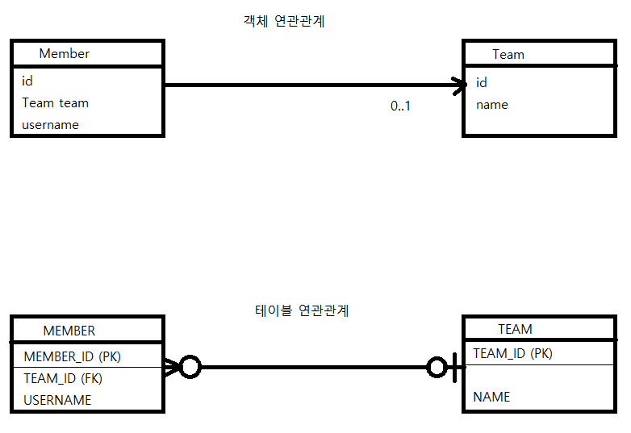
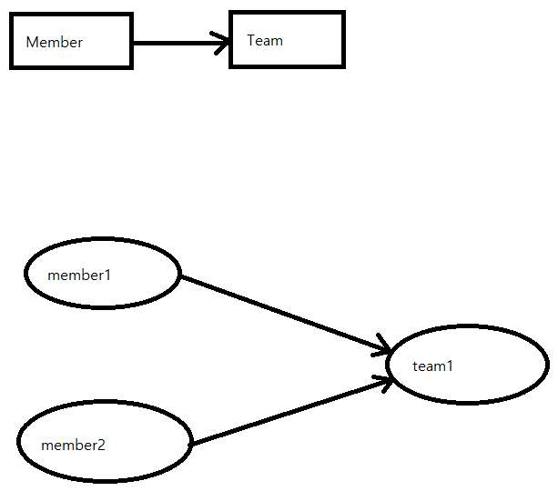

### 연관관계 매핑 기초
- 연관관계 매핑을 이해하기 위한 핵심 키워드
1. 방향
   - 한 쪽만 참조하는 것을 단방향
   - 양쪽 모두 서로 참조하는 것을 양방향
   - 방향은 객체 관계에만 존재하고 테이블 관계는 항상 양방향이다. 
2. 다중성
   - 다대일
   - 일대다
   - 일대일
   - 다대다
   - 여러개의 B객체가 하나의C 객체에 속한다면 B와 C는 다대일 관계이고 C와 B는 일대다 관계이다.
3. 연관관계의 주인
   - 객체를 양방향 연관관계로 만들면 연관관계의 주인을 정해야 한다.
    
#### 단방향 연관관계


- 객체 연관관계
   - 회원 객체는 Member.team 필드(멤버 변수)로 팀 객체와 연관관계를 맺는다.
   - 두 객체는 단방향 관계이다.
      - 회원은 Member.team 필드를 통해 팀을 알 수 있지만 반대로 팀은 회원을 알 수 없다.
   
- 테이블 연관관계
   - 회원 테이블은 TEAM_ID 외래 키로 팀 테이블과 연관관계를 맺는다.
   - 두 테이블은 양방향 관계다.
      - 회원 테이블의 TEAM_ID 외래 키를 통해 회원과 팀을 조인할 수 있고 반대로 팀과 회원도 조인할 수 있다.
   
- 객체 연관관계와 테이블 연관관계의 차이
    - 참조를 통한 연관관계를 항상 단방향
    - 객체간 양방향 연관관계를 만들기 위해서는 반대쪽에도 필드를 추가해 참조를 보관해야 한다.
    - 양방향 관계가 아닌 서로 다른 방향을 가진 단방향 관계 2개다.
    
- 객체 연관관계 vs 테이블 연관관계
    - 객체는 참조(주소)로 연관관계를 맺는다
    - 테이블은 외래 키로 연관관계를 맺는다.
    - 객체의 연관관계를 단방향
    - 테이블의 연관관계는 양방향
    
##### 순수한 객체 연관관계
```java
public class Member {
    private String di;
    private String username;
    
    private Team team;
    
    public void setTEam(Team team) {
        this.team = team;
    }
    
    //Getter, Setter...
}

public class Team {
    private String id;
    private String name;
    
    //Getter, Setter...
}
```

```java

public static void main(String[] args) {
    //생성자 (id, 이름)
    Member member1 = new Member("member1", "회원1");
    Member member2 = new Member("member2", "회원2");
    Team team1 = new Team("team1", "팀1");
    
    member1.setTeam(team1);
    member2.setTeam(team2);
    
    Team findTeam = member1.getTeam();
}
```


- 위 그림을 보면 회원1과 회원2는 팀1에 속해있다
```java
Team findTeam = member1.getTeam();
```
- 객체는 참조를 사용해서 연관관계를 탐색하는데 이것을 객체 그래프 탐색이라고 한다.

##### 객체 관계 매핑
```java
@Entity
public class Member {
    @Id
    @Column(name = "MEMBER_ID")
    private String id;
    private String username;
    
    @ManyToOne
    @JoinColumn(name="TEAM_ID")
    private Team team;
    
    public void setTeam(Team team) {
        this.team  = team;
    }
}
```

```java
@Entity
public class Team {
    @Id
    @Column(name = "TEAM_ID")
    private String id;
    
    private String name;
}
```

- 객체 연관관례: 회원 객체의 Member.team 필드 사용
- 테이블 연관관계: 회원 테이블의 MEMBER.TEAM_ID 외래 키 컬럼을 사용


- Member.team과 MEMBER.TEAM_ID를 매핑하는 것이 연관관계 매핑이다.
```java
//연관관계 매핑 코드
@ManyToOne
@JoinColumn(name="TEAM_ID")
private Team team;
```
- @ManyToOne: 다대일 (N:1) 관계라는 매핑 정보.
- @JoinColumn: 조인 컬럼은 외래 키를 매핑할 때 사용한다. name 속성에는 매핑할 외래 키 이름을 지정한다.


#### 연관관계 사용
##### 저장
- 연관관계를 매핑한 엔티티의 저장
```java
public void testSave() {
    
    //팀1 저장
    Team team1 = new Team("team1", "팀1");
    em.persist(team1);
    
    //회원1 저장
    Member member1 = new Member("member1", "회원1");
    member1.setTeam(team1);
    em.persist(member1);

    //회원2 저장
    Member member2 = new Member("member2", "회원2");
    member2.setTeam(team1);
    em.persist(member2);
}
```
- JPA에서 엔티티를 저장할 떄 연관된 모든 엔티티는 영속 상태여야 한다.
```java
member1.setTeam(team1); // 회원 -> 팀 참조
em.persist(member1); //저장
```
- 회원 인테테는 팀 엔티티를 참조하고 저장했다. JPA는 참조한 팀의 식별자(Team.id)를 외래 키로 사용해 등록 쿼리를 생성한다.
```sql
INSERT INTO TEAM (TEAM_ID, NAME) VALUES ('team1', '팀1')
INSERT INTO MEMBER (MEMBER_ID, NAME, TEAM_ID) VALUES ('member1', '회원1', 'team1')
INSERT INTO MEMBER (MEMBER_ID, NAME, TEAM_ID) VALUES ('member2', '회원2', 'team1')
```

##### 수정
```java
private static void updateRelation(EntityManager em) {
    Team team2 = new Team("team2", "팀2");
    em.persist(team2);
    
    Member member = em.find(Member.class, "member1");
    member.setTeam(team2);
}
```
-불러온 엔티티의 값만 변경해두면 트랜잭션을 커밋할 때 플러시가 일어나면서 변경 감지 기능이 작동하고 변경사항을 데이터베이스에 자동으로 반영한다.
- 연관관계 수정시에도 참조하는 대상만 변경하면 나머지는 JPA가 처리해준다.
##### 삭제
```java
private static void deleteRelation(EntityManager em) {
    Member member1 = em.find(Member.class, "member1");
    member1.setTeam(null);
}
```
##### 조회
- 연관관계가 있는 엔티티를 조회하는 방법은 크게 2가지다
1. 객체 그래프 탐색 (객체 연관관계를 사용한 조회)
   - member.getTeam()을 사용해 member와 연관된 team 엔티티를 조회할 수 있다.
```java
Member member = em.find(Member.class, "member1");
Team team = member.getTeam(); //객체 그래프 탐색
System.out.println("팀이름 = " + team.getName()); // 팀 이름 = 팀1
```    
2. 객체지향 쿼리 사용 (JPQL)
    - 회원을 대상으로 조회하는데 팀1에 소속된 회원만 조회하려면 회원과 연관된 팀 엔티티를 검색 조건으로 사용해야 한다.
    - SQL은 연관된 테이블을 조인해서 검색조건을 사용하면 된다.
```java
private static void queryLogicJoin(EntityManager em) {
    String jpql = "select m from Member m join m.team t where " + "t.name =:teamName";
    
    List<Member> resultList = em.createQuery(jpql, Member.class).setParameter("teamName", "팀1").getResultList();
    
    for (Member member : resultList) {
        System.out.println("[query] member.username="+member.getUsername());
    }
}
```
- **from Member m join m.team** 부분을 보면 회원이 팀과 관계를 가지고 있는 필드 (m.team)를 통해서 Member와 Team을 조인하고 where 절에서 조인한 t.name을 검색조건으로 사용해 팀1에 속한 회원만 검색했다.
##### 연관된 엔티티 삭제
- 연관된 엔티티를 삭제하려면 기존에 있던 연관관계를 먼저 제거하고 삭제해야 한다.
```java
member1.setTeam(null);
member2.setTeam(null);
em.remove(team);
```
- 연관관계를 먼저 제거하지 않으면 외래 키 제약조건으로 인해 데이터베이스에서 오류가 발생한다.

#### 양방향 연관관계