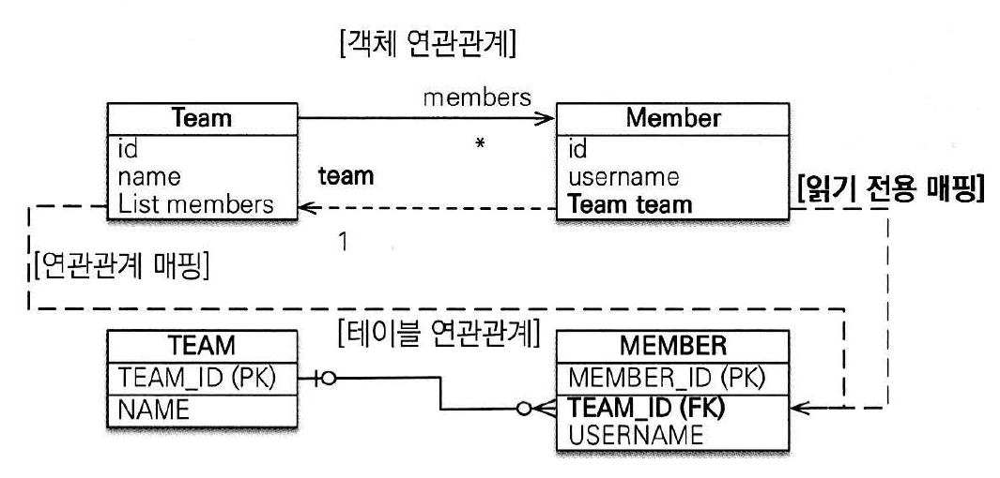
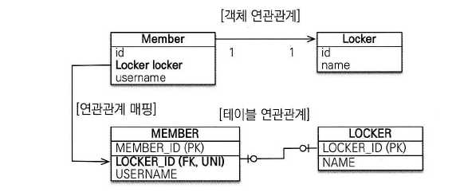
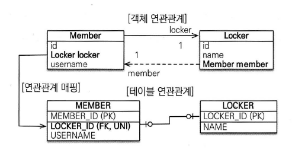
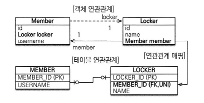
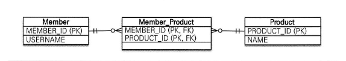

### 다양한 연관관계 매핑

- 엔티티 연관관계 매핑시 고려해야 할 3가지

1. 다중성
2. 단방향, 양방향
3. 연관관계의 주인

- 먼저 연관관계가 있는 두 엔티티가 일대일 관계인지 일대다 관계인지 다중성을 고려해야 한다.
- 두 엔티티 중 한쪽만 참조하는 단방향 관계인지 서로 참조하는 양방향 관계인지 고려해야 한다.
- 양방향 관계면 연관관계의 주인을 정해야 한다.

##### 다중성

- 연관관계의 다중성

1. 다대일
2. 일대다
3. 일대일
4. 다대다

- 일대다의 반대는 항상 다대일
- 일대일의 반대는 항상 일대일

##### 6.1 다대일

- 데이터베이스 테이블의 일대다 관계에서 외리 키는 항상 다쪽에 있다. 따라서 객체 양방향 관계에서 연관관계의 주인은 항상 다쪽이다.
- **양방향 연관관계에서는 항상 다쪽에 외래 키가 있고 외래 키를 가진 쪽이 연관관계의 주인이다**
- 양방향 연관관계는 항상 서로를 참조해야 한다.

##### 6.2 일대다

- 일대다 관계는 엔티티를 하나 이상 참조할 수 있으므로 자바 컬렉션중에 하나를 사용해야 한다.

###### 일대다 단방향

- 일대다 단방향 관계는 약간 특이하다
    - 일대다 단방향은 반대쪽 테이블에 있는 외래 키를 관리한다.
    - 보통은 자신이 매핑한 테이블의 외래 키를 관리함

```java

@Entity
public class Team {
    @Id
    @GeneratedValue
    @Column(name = "TEAM_ID")
    private Lond id;

    private String name;

    @OneToMany
    @JoinColumn(name = "TEAM_ID") // MEMBER 테이블의 TEAM_ID (FK)
    private List<Member> members = new ArrayList<Member>();
}
```

```java

@Entity
public class Member {
    @Id
    @GeneratedValue
    @Column(name = "MEMBER_ID")
    private Long id;

    private String username;
}
```

- 일대다 단방향 관계를 매핑할 때는 @JoinColumn을 명시해야한다. 그렇지 않으면 JPA는 연결 테이블을 중간에 두고 연관관계를 관리하는 조인 테이블 전략을 사용한다.

```java
public void testSave(){
        Member m1=new Member("member1");
        Member m2=new Member("member2");

        Team t1=new Team("team1");
        t1.getMembers().add(m1);
        t1.getMembers().add(m2);

        em.persist(m1);
        em.persist(m2);
        em.persist(t1);

        transaction.commit();

        }
```

```sql
-- 위 코드의 실행 결과 SQL
insert into Member (MEMBER_ID, username)
values (null, ?)
    insert
into Member (MEMBER_ID, username)
values (null, ?)
insert into Team (TEAM_ID, name)
values (null, ?)
update Member
set TEAM_ID=?
where MEMBER_ID = ?
update Member
set TEAM_ID=?
where MEMBER_ID = ?
```

- Member 엔티티는 Team 엔티티를 모르고 연관관계에 대한 정보는 Team 엔티티의 members가 관리한다. 따라서 Member 엔티티를 저장할 때는 MEMBER 테이블의 TEA_ID 외래 키에 아무 값도
  저장되지 않는다.
- 대신 Team 엔티티를 저장할 때 Team.members의 참조 값을 확인해서 회원 테이블에 있는 TEAM_ID 외래 키를 업데이트 한다.

- **일대다 단방향 보다는 다대일 양방향 매핑을 사용하자**

###### 6.2.2 일대다 양방향

- 일대다 양방향 매핑은 존재하지 않기에 다대일 양방향 매핑을 사용해야 한다.
    - 더 정확히는 양방향 매핑에서 @OneToMany는 연관관계의 주인이 될 수 없다.
    - 데이터베이스의 특성상 일대다, 다대일 관계는 항상 다 쪽에 외래 키가 있기 때문에 @OneToMany, @ManyToOne 둘 중에 연관관계의 주인은 항상 다 쪽인 @ManyToOne을 사용한 곳이다.

- 하지만 일대다 양방향 매핑이 완전히 불가능한것은 아니다.
- 일대다 단방향 매핑 반대편에 같은 외래 키를 사용하는 다대일 단방향 매핑을 읽기 전용으로 하나 추가하면 된다.
  

```java
import javax.annotation.processing.Generated;

@Entity
public class Team {
    @Id
    @GeneratedValue
    @Column(name = "TEAM_ID")
    private Long id;

    private String name;

    @OneToMany
    @JoinColumn(name = "TEAM_ID")
    private List<Member> members = new ArrayList<Member>();
}
```  

```java

@Entity
public class Member {
    @Id
    @GeneratedValue
    @Column(name = "MEMBER_ID")
    private Long id;
    private String username;

    @ManyToOne
    @JoinColumn(name = "TEAM_ID", insertable = false, updatable = false)
    private Team team;
}
```

- 일대다 단방향 매핑 반대편에 다대일 매핑을 추가했다.
- 이때 일대다 단방향 매핑과 같은 TEAM_ID 외래 키 컬럼을 매핑했다. 이렇게 되면 둘 다 같은 키를 관리하므로 문제가 발생할 수 있다.
    - 반대편인 다대일 쪽은 insertable을 설정해서 오직 읽기만 가능하게 한다.

- 이 방법은 일대다 단방향 매핑 반대편에 다대일 단방향 매핑을 읽기 전용으로 추가해 일대다 양방향처럼 보이게 하는 방법이다. 즉 일대다 단방향 매핑이 가지는 단점을 그대로 가지고 있다.
- **될 수 있으면 다대일 양방향 매핑을 사용하자**

##### 6.3 일대일

- 양쪽이 서로 하나의 관계만 가진다.
- 일대일 관계의 반대 역시 일대일 관계다
- 일대일 관계에서는 둘 중 어느 곳이나 외래 키를 가질 수 있다.
    - 일대일 관계는 주 테이블이나 대상 테이블 중에 누가 외래 키를 가질지 선택해야 한다.

- 주 테이블에 외래 키
    - 주 객체가 대상 객체를 참조하는 것처럼 주 테이블에 외래 키를 두고 대상 테이블을 참조한다.
    - 외래 키를 객체 참조와 비슷하게 사용할 수 있어서 객체지향 개발자들이 선호한다.
    - 이 방법의 장점은 주 테이블이 외래 키를 가지고 있으므로 주 테이블만 확인해도 대상 테이블과 연관관계가 있는지 알 수 있다.

- 대상 테이블에 외래 키
    - 이 방법의 장점은 테이블 관계를 일애일에서 일대다로 변경할 때 테이블 구조를 그대로 유지할 수 있다는 점이다.

###### 6.3.1 주 테이블에 외래 키

- 객체지향 개발자들은 주 테이블에 외래 키가 있는 것을 선호한다.

**단반향**


- 객체 매핑에 @OneToOne을 사용하고 데이터베이스에는 LOCKER_ID 외래 키에 유니크 제약 조건을 추가했다.
- 다대일 단방향과 거의 비슷하다.

```java
//주 테이블, 주 객체
@Entity
public class Member {
    @Id
    @GeneratedValue
    @Column(name = "MEMBER_ID")
    private Long id;

    private String username;

    @OneToOne
    @JoinColumn(name = "LOCKER_ID")
    private Locker locker;
}

@Entity
public class Locker {
    @Id
    @GeneratedValue
    @Column(name = "LOCKER_ID")
    private Long id;

    private String name;
}
```

**양방향**


```java
//주 테이블, 주 객체
@Entity
public class Member {
    @Id
    @GeneratedValue
    @Column(name = "MEMBER_ID")
    private Long id;

    private String username;

    @OneToOne
    @JoinColumn(name = "LOCKER_ID")
    private Locker locker;
}

@Entity
public class Locker {
    @Id
    @GeneratedValue
    @Column(name = "LOCKER_ID")
    private Long id;

    private String name;

    @OneToOne(mappedBy = "locker")
    private Member member;
}
```
- 양방향이므로 연관관계의 주인을 정해야 한다. MEMBER 테이블이 외래 키를 가지고 있으므로 Member 엔티티에 있는 Member.locker가 연관관계의 주인이 된다.

###### 6.3.2 대상 테이블에 외래 키
- 단방향
  - 일대일 관계 중 대상 테이블에 외래 키가 있는 단방향 관계는 JPA에서 지원하지 않는다.
  
- 양방향
  - 대상 테이블에 외래 키가 있는 양방향 관계
  

```java
//주 테이블, 주 객체
@Entity
public class Member {
    @Id
    @GeneratedValue
    @Column(name = "MEMBER_ID")
    private Long id;

    private String username;

    @OneToOne(mappedBy = "member")
    private Locker locker;
}

@Entity
public class Locker {
    @Id
    @GeneratedValue
    @Column(name = "LOCKER_ID")
    private Long id;

    private String name;

    @OneToOne
    @JoinColumn(name = "MEMBER_ID")
    private Member member;
}
```
- 일대일 매핑에서 대상 테이블에 외래 키를 두고 싶다면 양방향으로 매핑한다.
- 주 엔티티인 Member 엔티티 대신 대상 엔티티인 Locker 엔티티를 연관관계의 주인으로 만들어 LOCKER 테이블의 외래 키를 관리하도록 한다.

- **프록시를 사용할 때 외래 키를 직접 관리하지 않는 일대일 관계는 지연 로딩으로 설정해도 즉시 로딩된다**
  - 위의 예시에서 Locker.member는 지연 로딩이 가능하지만 Member.locker는 지연 로딩으로 설정해도 즉시 로딩된다.
  - 이를 해결하기 위해 프록시 대신 bytecode instrumentation을 사용하면 해결할 수 있다.
  

##### 6.4 다대다
- 관계형 데이터 베이스는 정규화된 테이블 2개로 다대다 관계를 표현할 수 없다.
- 다대다 관계를 일대다, 다대일 관계로 풀어내는 연결 테이블을 사용한다.

  
- 하지만 객체는 테이블과 갈리 객체 2개로 다대다 관계를 만들 수 있다.
- 예를 들어 회원 객체를 컬렉션을 사용해서 상품들을 참조하고, 반대로 상품들도 컬렉션을 사용해 회원들을 참조하면 된다.

###### 다대다: 단방향